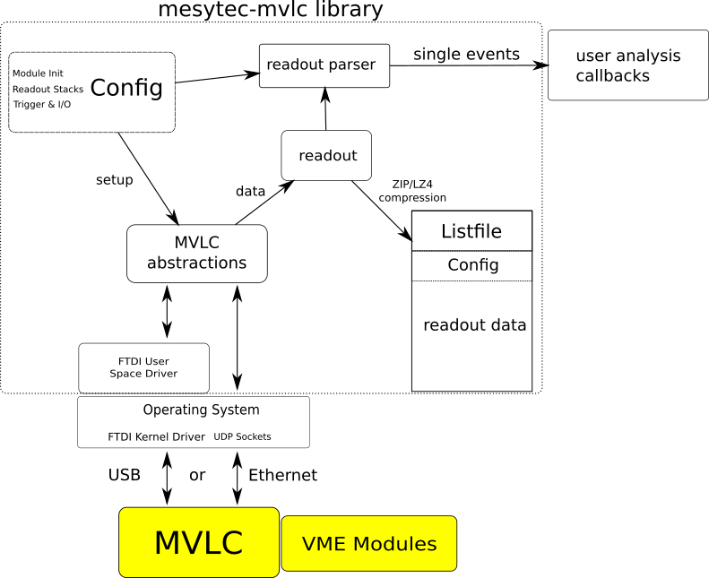

# mesytec-mvlc - User space driver library for the [mesytec MVLC VME Controller](https://mesytec.com/products/nuclear-physics/MVLC.html)

- [mesytec-mvlc - User space driver library for the mesytec MVLC VME Controller](#mesytec-mvlc---user-space-driver-library-for-the-mesytec-mvlc-vme-controller)
  - [Intro](#intro)
  - [Structure](#structure)
  - [Limitations](#limitations)
  - [Installation](#installation)
  - [Using the Library](#using-the-library)

## Intro

*mesytec-mvlc* is a driver and utility library for the [Mesytec MVLC VME
controller](https://mesytec.com/products/nuclear-physics/MVLC.html) written in
C++. The library consists of low-level code for accessing MVLCs over USB or
Ethernet and higher-level communication logic for reading and writing internal
MVLC registers and accessing VME modules. Additionally the basic blocks needed
to build high-performance MVLC based DAQ readout systems are provided:

* Configuration holding the setup and readout information for a single VME
  crate containing multiple VME modules.

* Multithreaded readout worker and listfile writer using fast data compression
  (LZ4 or ZIP deflate).

* Readout parser which is able to handle potential ethernet packet loss.

* Live access to readout data on a best effort basis. Sniffing at the data
  stream does not block or slow down the readout.

* Examples showing how to combine the above parts into a working readout system
  and how to replay data from a previously recorded listfile.

* Various counters for monitoring the system.

* Can use configs exported from [mvme](https://mesytec.com/downloads/mvme.html).

## Structure

* MVLC USB and Ethernet/UDP implementations
  - Two pipes (mapped to USB endpoints or UDP ports)
  - Buffered reads for direct communication
  - Unbuffered/low level reads for high-performance
  - Counters

* Dialog layer - internal and VME register read/write access
  - UDP retries to mitigate packet loss

* Stack error notification polling
* Standard Listfile format plus writer and reader code
* Multithreaded readout worker
* Thread-safe readout buffer queues. Allows to sniff and analyze data in a
  separate thread during a DAQ run.
* Abstractions for building MVLC command stacks
* Command stack memory management and uploading
* Readout/Response Parser using information from the readout stacks to parse
  incoming data.
* Single VME Crate readout config:
  - List of stack triggers: required to setup the MVLC
  - List of readout stacks: required for the MVLC setup and for parsing the data stream
  - VME module init sequence
  - MVLC Trigger I/O init sequence

* Single VME Crate readout instance:
  - readout config
  - readout buffer structure with crateId, number, type, capacity, used and
    view/read/write access
  - readout buffer queue plus operations (blocking, non-blocking)
  - listfile output (the readout config is serialized into the listfile at the start)

* Listfile writer and reader
  - Standard listfile format, compatible with mvme
  - Multithreaded writer
  - LZ4 and ZIP (deflate) compression support

## Limitations

* There are currently no abstractions for the MVLC Trigger/IO system.

  The Trigger/IO system can still be configured by manually writing the correct
  MVLC registers. When using a CrateConfig generated by
  [mvme](https://mesytec.com/downloads/mvme.html) the Trigger/IO setup is
  included and will be applied during the DAQ init procedure.

  Once the Trigger/IO Module has matured and is feature complete an appropriate
  software abstraction will be added.

* Multicrate readouts are not yet supported. In theory multiple MVLCs can be
  read out from a single process but there is no time synchronization between
  crates. Multicrate support will be added with future firmware and library revisions.

## Installation

The library works on Linux and Windows. The only required external dependency is
zlib. Optionally [**libzmq**](https://github.com/zeromq/libzmq) can be used to
transport readout data.

Windows builds currently only work in an [MSYS2](https://www.msys2.org/)
environment. Add ``-G"MSYS Makefiles"`` to the cmake command line to generate a
working build system.

    git clone https://github.com/flueke/mesytec-mvlc
    mkdir mesytec-mvlc/build
    cd mesytec-mvlc/build
    cmake -DCMAKE_BUILD_TYPE=Release -DCMAKE_INSTALL_PREFIX=~/local/mesytec-mvlc ..
    make install

## Using the Library

* [Library guide](doc/usage_guide.md)
* [Readout data format and parsing](doc/data_format.md)
* [Notes on the flash interface](doc/notes-vme-flash-interface.md)
